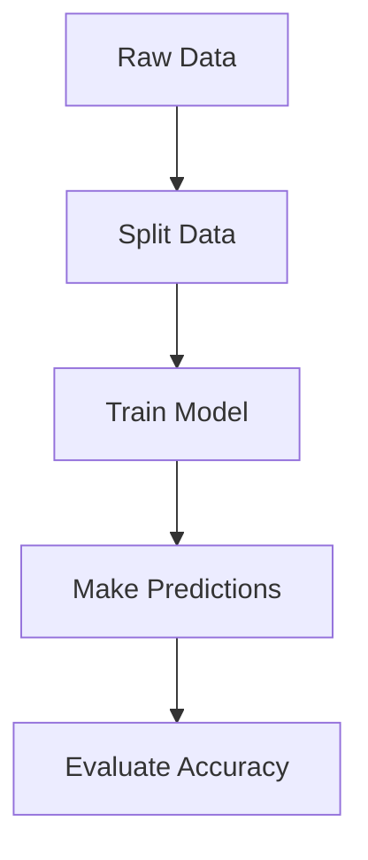

## Section 1. Machine Learning Fundamentals

## 1.1 What is Machine Learning?
### Everyday Examples
- **Email filtering**:  
  ```r
  # Simulating email classification
  emails <- data.frame(
    word_count = c(20, 150, 80, 300),
    has_link = c(0, 1, 0, 1),
    is_spam = c(0, 1, 0, 1)
  )
  print(head(emails))
  ```
## Question: What are the special features of spam emails?

- **Weather prediction**:  
  `weather_data <- data.frame(temp = c(15,22,18), humidity = c(60,85,72), rain = c(0,1,0))`

## Question: What are the special features of rainy days?
---

## 1.2 Supervised vs Unsupervised Learning
### Comparison Table
|                  | Supervised       | Unsupervised      |
|------------------|------------------|-------------------|
| **Data**         | Labeled          | Unlabeled         |
| **Goal**         | Predict outcomes | Find patterns     |
| **Biomed Example**| Cancer diagnosis | Gene clustering   |

---

### Supervised Example (Classification)
```r
# Using iris dataset
library(caret)
data(iris)
model <- train(Species ~ ., data=iris, method="rpart") # Decision Tree
print(varImp(model))
result=cbind(as.character(predict(model)),as.character(iris$Species))
head(result)
```

### Unsupervised Example (Clustering)
```r
# Generate gene expression data
set.seed(123)
gene_data <- matrix(rnorm(300), ncol=3)
clusters <- kmeans(gene_data, centers=2)
plot(gene_data, col=clusters$cluster)
```

---

## 1.3 Machine Learning Workflow
### Iris Classification Process


---

### Code Implementation
```r
# Train-test split
train_idx <- createDataPartition(iris$Species, p=0.8)$Resample1
train_data <- iris[train_idx, ]
test_data <- iris[-train_idx, ]

# Train Model
model <- train(Species ~ ., data=train_data, method="rpart") # Decision Tree

# Make Predictions
predict_species=predict(model,newdata=test_data)
predict_species=paste0('predict_',predict_species)
table(as.character(predict_species),as.character(test_data$Species))
```

---

## 1.4 Key Terminology
### Feature vs Label
```r
# Create simple dataset
patient_data <- data.frame(
  age = c(25, 47, 32),
  bp = c(120, 140, 130),
  diabetes = c(0, 1, 0) # Label
)
print(patient_data)
```

---


## Section 2. Data Preprocessing Essentials

---

## 2.1 Handling Missing Values

### Detecting Missing Values
```R
# Using built-in airquality dataset
data(airquality)
sum(is.na(airquality$Ozone))
```
- `is.na()` identifies missing values (NA)
- Always check NA count before processing

### Removing Missing Values
```R
clean_data <- na.omit(airquality)
nrow(airquality)  # Original: 153
nrow(clean_data)  # Cleaned: 111

tmp_data=airquality
tmp_data=apply(tmp_data,2,function(x){x[which(is.na(x))]=0;return(x)})
nrow(tmp_data)
sum(is.na(tmp_data))

```
- `na.omit()` removes rows with any NA values
- Always document removed observations

---

## 2.2 Data Standardization

### Why Standardize?
```R
# Create gene expression data
set.seed(123)
gene_data <- data.frame(
  Gene1 = rnorm(5, mean=1000, sd=500),
  Gene2 = rnorm(5, mean=0.5, sd=0.1))
gene_data
```

### Applying Scale()
```R
scaled_data <- scale(gene_data)
round(scaled_data, 2)
```
- Centers to mean=0, scales to SD=1
- Essential for comparison between variables

---

## 2.3 Categorical Variable Encoding

### Clinical Data Example
```R
# Create sample clinical data
patients <- data.frame(
  age = c(45, 62, 38),
  group = c("Treatment", "Control", "Treatment"))
```

### Factor Conversion
```R
patients$group <- factor(patients$group)
levels(patients$group)  # Shows: "Control" "Treatment"
```
- Converts text labels to numbered factors
- Automatically handles category levels

---

## 2.4 Data Splitting

### Creating Sample Data
```R
library(caret)
set.seed(123)
big_data <- data.frame(
  feature = rnorm(200),
  outcome = sample(c("Yes","No"), 200, replace=TRUE))
```

### Partitioning Data
```R
split_index <- createDataPartition(big_data$outcome, p=0.7)
train_data <- big_data[split_index$Resample1, ]
test_data  <- big_data[-split_index$Resample1, ]
```
- 70% training / 30% testing split
- Preserves outcome distribution

---

## 2.5 Feature Selection

### Creating Features with Variance
```R
set.seed(123)
var_data <- data.frame(
  good_var = rnorm(100),
  bad_var = rep(c(1,1,1,1,1), 20))
```

### Identifying Low-Variance Features
```R
low_var <- nearZeroVar(var_data)
var_data_clean <- var_data[, -low_var]
names(var_data_clean)  # Removes "bad_var"
```
- Removes features with <10% unique values
- Helps improve model performance


## Section 3. Supervised Learning Algorithms


## Decision Trees with rpart

## What is Decision Tree:
https://www.bilibili.com/video/BV1Xp4y1U7vW?spm_id_from=333.788.recommend_more_video.-1&vd_source=37c5f739e0fd142e6274dbf50b4a4631

## rpart() Function Basics
```r
# Key parameters explanation
library(rpart)
iris_tree <- rpart(Species ~ ., 
                   data = iris)
```

## Iris Classification Demo
```r
# Full working example
set.seed(123)
train_idx <- sample(1:nrow(iris), 100)
iris_train <- iris[train_idx, ]
iris_test <- iris[-train_idx, ]

model <- rpart(Species ~ ., data = iris_train)
predictions <- predict(model, iris_test, type = "class")
```

---

# Visualizing Decision Trees

## Tree Diagram Plotting
```r
library(rpart.plot)
rpart.plot(model, 
           type = 3,
           extra = 104,
           box.palette = "Blues")
```

---

## Random Forest Fundamentals

## What is Random Forest:
https://www.bilibili.com/video/BV1H5411e73F/?spm_id_from=333.337.search-card.all.click

## randomForest() Essentials
```r
library(randomForest)
library(mlbench)
data(BreastCancer)

bc_clean <- na.omit(BreastCancer)
bc_clean$Class <- as.factor(bc_clean$Class)

set.seed(456)
rf_model <- randomForest(Class ~ Cl.thickness + Cell.size,
                         data = bc_clean)
```

---

# Variable Importance Analysis

## Feature Importance Plot
```r
varImpPlot(rf_model,
           main = "Breast Cancer Predictors",
           color = "darkgreen")
```

---

## Neural Network Basics

## What is Neural Network:
https://www.bilibili.com/video/BV1aV411z7FS/?spm_id_from=333.1387.homepage.video_card.click

## neuralnet Package Setup
```r
library(neuralnet)
# Simple OR gate example
or_gate <- data.frame(
  input1 = c(0,0,1,1),
  input2 = c(0,1,0,1),
  output = c(0,1,1,1)
)

nn <- neuralnet(output ~ input1 + input2,
                data = or_gate,
                hidden = 3)
predict(nn,newdata=or_gate)

plot(nn)
```


---
# Section 4. Model Evaluation Methodology


## 4.1 Confusion Matrix with caret
### What is a Confusion Matrix?
- TP: True Positive  
- TN: True Negative  
- FP: False Positive  
- FN: False Negative  

Accuracy = ( TP + TN )/ ( TP + TN + FP + FN )

Sensitivity = Recall = TP / (TP + FN)

Specificity = TN / (TN + FP)

Precision = TP / (TP + FP)

F1 = 2 * Precision * Recall / (Precision + Recall)


### Directly get result:
```r
library(caret)
data(iris)
# Simple classification model
model <- train(Species ~ ., data = iris, method = "rpart")
pred <- predict(model, iris)
caret::confusionMatrix(pred, iris$Species,mode='everything')
```

---

## Understanding Confusion Matrix Output
### Key Metrics from caret:
```r
# Sample output explanation:
Accuracy : 0.96  
95% CI : (0.9147, 0.9849)  
No Information Rate : 0.3333   # Guess Rate
P-Value [Acc > NIR] : < 2.2e-16  
Kappa : 0.94 # -1 to 1, 0 stands for guessing
```

---

## 4.2 ROC Curve with pROC
### Creating Basic ROC Curve:

X-axis: False Positive Rate = FPR = FP/(FP+TN)

Y-axis: True Positive Rate = TPR = TP/(TP+FN)

```r
library(pROC)
# Simulate binary data
set.seed(123)
prob <- runif(100)
actual <- ifelse(prob > 0.5, 1, 0) + rnorm(100, 0, 0.1)
roc_obj <- roc(actual, prob)
plot(roc_obj, main = "Sample ROC Curve")
auc(roc_obj)
```

---

## Interpreting ROC/AUC
### What Does AUC Mean?
- 0.5: Random guessing  
- 0.7-0.8: Acceptable  
- 0.8-0.9: Excellent  
- >0.9: Outstanding  


## 4.3 Regression Evaluation Metrics
### Calculating RMSE & R²:
```r
# Simple linear regression
model <- lm(mpg ~ wt, data = mtcars)
pred <- predict(model)
# Calculate metrics
rmse <- sqrt(mean((mtcars$mpg - pred)^2))
r_squared <- summary(model)$r.squared
cat("RMSE:", rmse, "\nR²:", r_squared)
```

---

## 4.4 Cross-Validation with caret
### 5-Fold CV Setup:
```r
ctrl <- trainControl(
  method = "cv",
  number = 5,
  verboseIter = TRUE
)
# Example with random forest
model_cv <- train(Species ~ ., data = iris, 
                 method = "rf",
                 trControl = ctrl)
print(model_cv)
```

---

## 4.5 Overfitting Demonstration
### Train vs Test Performance:
```r
# Generate synthetic data
set.seed(123)
x <- seq(0, 10, length=100)
y <- sin(x) + rnorm(100, 0, 0.5)
train_idx <- sort(sample(1:100, 70))

# Overfit polynomial model
over_model <- lm(y ~ poly(x, 20), subset = train_idx)
train_rmse <- sqrt(mean(resid(over_model)^2))
test_rmse <- sqrt(mean((predict(over_model, 
                              newdata=data.frame(x))[-train_idx] 
                       - y[-train_idx])^2))
print(train_rmse )
print(test_rmse )
```

---

## Overfitting Visualization
### Plotting the Results:
```r
plot(x, y, main = "Overfitting Example")
points(x[train_idx],y[train_idx],pch=16,col='red')
lines(x[train_idx], predict(over_model), 
      col="red", lwd=2)
legend("topright", 
       legend=c(paste0("Train RMSE: ",round(train_rmse,2)), paste0("Test RMSE: ",round(test_rmse,2))),
       col=c("black", "black"), lty=1)
```
