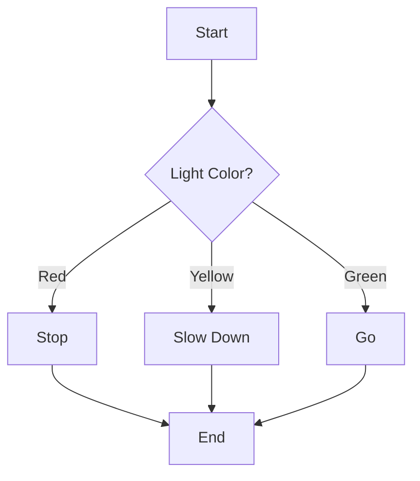
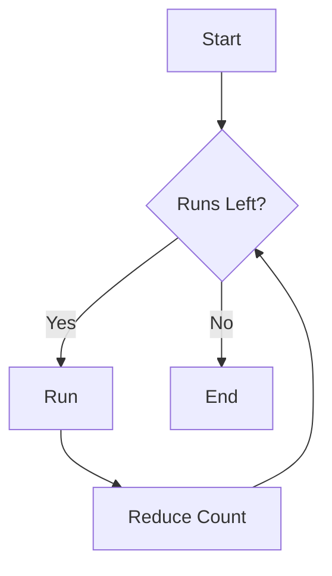
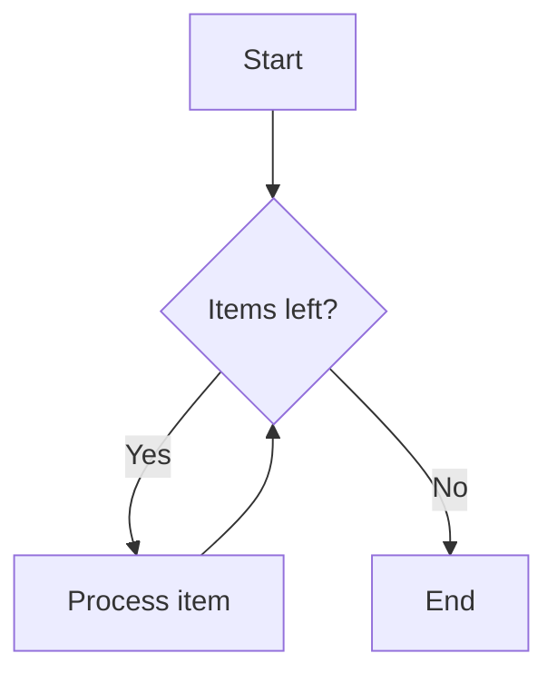
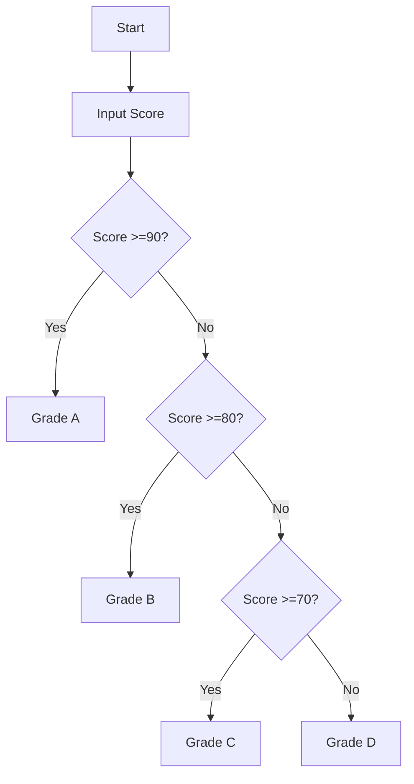
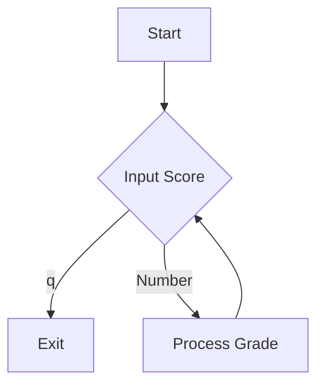
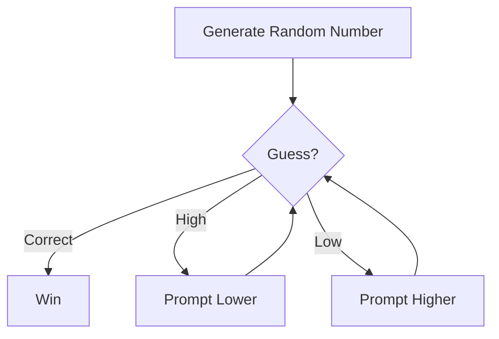
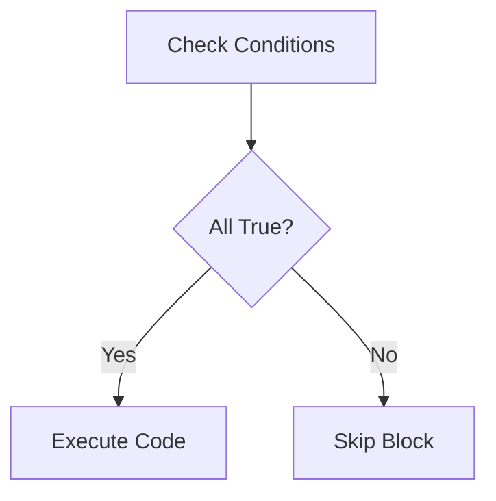
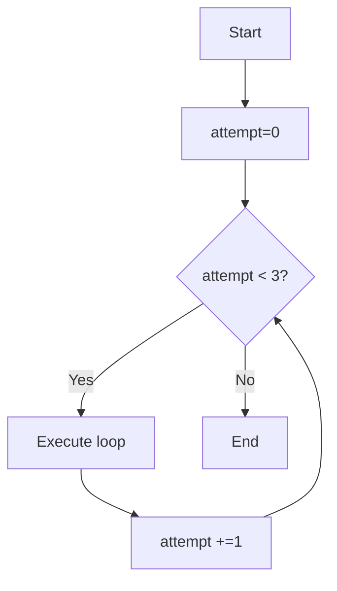

# Section 1. Control Flow

---

# Conditional Statements
Like traffic lights control vehicles:
```python
light_color = input("Traffic light color: ")

if light_color == "red":
    print("STOP")
elif light_color == "yellow":
    print("SLOW DOWN")
elif light_color == "green":
    print("GO")
else:
    print("INVALID COLOR")
```

---

# Flowchart - Decision Making


---

# While Loops
Like repeating morning runs:
```python
import time
runs_remaining = 3
while runs_remaining > 0:
    time.sleep(1) # suppose you are a superman, 400m in 1 second 
    print("Morning run #"+str(4 - runs_remaining)+" completed!")
    runs_remaining -= 1
print("All runs finished!")
```

---

# Flowchart - Loop Execution


---

# Why Control Flow Matters
1. Programs need to make decisions
2. Handle different situations
3. Repeat tasks efficiently
4. Makes code adaptable

Example: Automatic door control
```python

# since we don't have a sensor, we just pretend to be a sensor.

import time

def object_detected():
    # get signal from the sensor
    signal = input('detected(y/n):')
    if signal=='y':
        result=True
        print('detected!')
    else:
        result=False
        print('no object!')
    time.sleep(1)
    return(result)

def keep_open():
    print('open door!')
    # send signal to the door
    time.sleep(1)

def close_door():
    print('close door!')
    # send signal to the door
    time.sleep(1)

sensor_active = True

while sensor_active:
    if object_detected():
        keep_open()
    else:
        close_door()

```

---

# Vending machine

Let's code a drink machine:
```python
coins = 0
while coins < 5:
    insert_coins = int(input("Insert coin (1-3): "))
    coins = coins + insert_coins
    print("Total inserted: "+str(coins))
print("Here's your drink!")
```

### Question: how can we limit the number of inserted coins each time
### Question: how can we get the extra coins

---

# Common Patterns
1. Flag-controlled loops
```python
running = True
while running:
    user_input = input("Continue? (y/n): ")
    if user_input == "n":
        running = False
```

2. Counter-controlled loops
```python
attempts = 3
while attempts > 0:
    # code here
    attempts=attempts-1

attempts = 0
while attempts < 10:
    # code here
    attempts=attempts+1
```

---

# Take-home message
1. `if-elif-else` for decisions
2. `while` for repeating tasks
3. Condition evaluation (True/False)
4. Loop control variables (i, counter)
5. Avoid infinite loops!
```python
# Always update condition!
i = 0
while i < 10:
    print(i)
    i = i+1  # Don't forget this!
```


# Section 2. Conditionals in Python

---

### 1. `if` Statement Basics
```python
# Basic structure
age = 18
if age >= 18:
    print("You can vote!")
```

- `if` = Program's "what if" question
- Colon `:` is mandatory (show error without colon)
- Indentation = 4 spaces (never mix with Tab)

---

### 2. Indentation Demo
```python
# Correct vs Wrong
if True:
    print("Right")  # ← 4 spaces

if True:
print("Wrong")     # ← No indentation
```

---

### 3. Comparison Operators
```python
height = 175
print(height > 160)  # True
print(height == 170) # False

# Real-life example
bus_height_limit = 200
luggage_height = 210
if luggage_height > bus_height_limit:
    print("Cannot take bus")
```

---

### 4. Logical Operators
```python
# Weather check
is_raining = True
has_umbrella = False

if is_raining and has_umbrella:
    print("Go outside")
else:
    print("Stay home")
```

- `and`: Both must be True
- `or`: At least one True
- `not`: Reverse boolean

---

### 5. Common Mistake Fix
```python
# Wrong
if temperature = 30:
    print("Hot")

# Correct
if temperature == 30:
    print("Hot")
```

- Single `=` is assignment
- Double `==` is comparison

---

### 6. Multi-Condition Flow
```python
age = 15

if age < 13:
    print("Child ticket")
elif age < 18:
    print("Teen ticket")
else:
    print("Adult ticket")
```

---

### 7. Nested Conditions
```python
age = 20
is_student = True

if age < 18:
    print("50% discount")
else:
    if is_student:
        print("30% discount")
    else:
        print("No discount")
```

- Each level needs 4-space indent
- Max 3 nesting levels recommended

---

### 8. Ticket System Flowchart

```python
# Full example
age = 25
is_student = False
has_membership = True

if age < 5:
    print("Free ticket")
elif age < 18:
    print("Child ticket")
elif is_student:
    print("Student discount")
elif has_membership:
    print("Membership discount")
else:
    print("Regular ticket")
```

### Question: what if you are a 19 years old student without membership.
### Question: what if you are a 19 years old student with membership.
### Question: how can we get both the Student discount and the Membership discount
---

### 9. Truth Value Testing
```python
# Common False values:
- False
- None
- 0
- "" (empty string)
- [] (empty list)

name = ""
if not name:
    print("Name is required!")
```

---

### 10. Short-form Conditional Expression (not recommended)
```python
# Short form
temperature = 28
message = "Hot" if temperature > 25 else "OK"
print(message)

# preferred
temperature = 28
if temperature >25:
    message='Hot'
else:
    message='OK'
print(message)

```

- Use for simple two-way choices
- Not recommended for complex logic


# Section 3. Loop Structures in Python

---

### 1. For Loop Basics
```python
# Like checking a shopping list
groceries = ["apple", "milk", "bread"]
for item in groceries:
    print("Don't forget to buy:", item)
```



---

### 2. The range() Function
**Three usages:**
```python
# Single argument
for num in range(5):
    print(num)  # 0-4

# Two arguments
for num in range(2, 5):
    print(num)  # 2-4

# Three arguments
for num in range(0, 10, 2):
    print(num)  # 0,2,4,6,8
```

---

### 3. String Traversal with Index
```python
word = "hello"
for index, letter in enumerate(word):
    print("Character at position "+str(index)+": "+letter)
```
Output:
```
Character at position 0: h
Character at position 1: e
...
```

---

### 4. While Loop Mechanics
```python
# Like a persistent alarm clock
countdown = 3
while countdown > 0:
    print(countdown)
    countdown = countdown-1
print("Go!")
```

---

### 5. Termination Condition Design
```python
# Dangerous version (for demonstration)
# temperature = 25
# while temperature > 20:
#     print("AC running")
# Forgot to decrease temperature!
```

---

### 6. Safe Loop Writing Technique
**Always write termination first:**
```python
# 1. Set initial value
counter = 0
# 2. Define termination
MAX_ATTEMPTS = 3

while counter < MAX_ATTEMPTS:
    print("Attempt:", counter+1)
    counter += 1
```

---

### 7. Break Statement
```python
# Emergency exit example
passwords = ["123", "admin", "letmein"]
for pwd in passwords:
    if pwd == "admin":
        print("Security alert!")
        break
    print("Checking:", pwd)
```

---

### 8. Continue Statement
```python
# Skip odd numbers
for num in range(10):
    if num % 2 != 0:
        continue
    print(num, "is even")
```

---

### 9. Else Clause in Loops
```python
# Only executes if loop completes normally
numbers = [2, 4, 6]
for n in numbers:
    if n % 2 != 0:
        break
else:
    print("All numbers are even!")
```

---

### 10. Nested Loops: Multiplication Table
```python
for i in range(1, 4):  # Rows
    for j in range(1, 4):  # Columns
        print(str(i)+'x'+str(j)+'='+str(i*j), end="\t")
    print()  # New line after each row
```
Output:
```
1x1=1   1x2=2   1x3=3
2x1=2   2x2=4   2x3=6
3x1=3   3x2=6   3x3=9
```

---

### 11. Understanding Indentation Levels
```python
# Outer loop (level 1)
for x in range(2):
    # Inner loop (level 2)
    for y in range(2):
        # Nested block (level 3)
        if x == y:
            print("Match at "+str(x)+','+str(y))
    # Back to level 1
    print("----")
```


# Section 4. Control Flow - Practical Examples

---

## Case 1: Smart Grade Rating System

### Basic Structure
```python
score = float(input("Enter score (0-100): "))

if score >= 90:
    print("Grade A")
elif score >= 80:
    print("Grade B")
elif score >= 70:
    print("Grade C")
else:
    print("Grade D")
```



---

## Adding Loop for Multiple Inputs

### Continuous Processing
```python
while True:
    score = input("Enter score (q to quit): ")
    
    if score.lower() == 'q':
        break
        
    # Grade logic here
    print(f"Grade: {grade}")
```



---

## Case 2: Number Guessing Game

### Core Game Loop
```python
import random
target = random.randint(1,100)

while True:
    guess = int(input("Guess (1-100): "))
    
    if guess == target:
        print("Correct!")
        break
    elif guess > target:
        print("Too high")
    else:
        print("Too low")
```



---

## Tracking Attempts

### Counter Implementation
```python
attempts = 0
while attempts < 5:
    # Game logic
    attempts += 1
    
if attempts == 5:
    print("Game Over! Number was", target)
```

---

## Victory/Failure Branches

### Final Conditions
```python
if guess == target:
    print(f"Victory in {attempts} tries!")
else:
    print(f"Failed! Number was {target}")
```

---

## Key Concepts Summary

1. `if-elif-else` for decision making
2. `while` loops for repeated actions
3. `try-except` for basic error handling
4. Counter variables for tracking state
5. Random module for game mechanics

---

## Final Complete Code Demo

### Grade System
```python
while True:
    # quit
    score = input("Enter score (q to quit): ")    
    if score.lower() == 'q':
        break
    # grade 
    score = float(input("Enter score (0-100): "))
    if score >= 90:
        grade = 'A'
    elif score >= 80:
        grade = 'B'
    elif score >= 70:
        grade = 'C'
    else:
        grade = 'D'
    print("Grade:"+grade)

```

### Guessing Game
```python
import random
target = random.randint(1,100)
attempts = 0

while attempts < 5:
    guess = int(input("Guess (1-100): "))
    if guess == target:
        print("Correct!")
        break
    elif guess > target:
        print("Too high")
    else:
        print("Too low")
    attempts=attempts+1

if guess == target:
    print("Victory in"+str(attempts)+" tries!")
else:
    print("Failed! Number was "+str(target))

```


# Section 5. Special Considerations

---

### 1. Multi-line Conditional Statements
```python
# Recommended style
if (temperature > 100 
    and humidity < 70 
    and is_sunny == True):
    print("Heat warning!")
```



---

### 2. Splitting Long Logical Expressions
```python
# Before
if (num > 0 and num%2 == 0 and num < 100 and name != "admin"):

# After
is_positive_even = num > 0 and num%2 == 0
within_limit = num < 100
valid_user = name != "admin"

if is_positive_even and within_limit and valid_user:
```

---

### 3. Debugging with Print Statements
```python
counter = 0
while counter < 3:
    print(f"DEBUG: Current counter - {counter}")  # Debug line
    counter += 1
```


---

### 4. Using TODO Comments
```python
def calculate_discount(price):
    # TODO: Add seasonal discount logic
    # TODO: Implement user tier system
    return price * 0.9  # Temporary 10% discount
```

---

### 5. Missing Colon Error
```python
# Incorrect
while x < 5
    print(x)
    x += 1

# Correct
while x < 5:
    print(x)
    x += 1
```

---

### 6. Indentation Error Examples
```python
# Wrong mixing of spaces/tabs
def count_down(n):
while n > 0:  # Missing indentation
print(n)      # Wrong level
    n -= 1

# Correct
def count_down(n):
    while n > 0:
        print(n)
        n -= 1
```

---

### 7. Floating Point Comparison
```python
# Unreliable
result = 0.1 + 0.2
if result == 0.3:
    print("Equal")

# Safe approach
tolerance = 1e-9
if abs(result - 0.3) < tolerance:
    print("Effectively equal")
```

---

### 8. While Loop Flow Control
```python
# Safe loop pattern
max_retries = 3
attempt = 0

while attempt < max_retries:
    print(f"Attempt {attempt+1}")
    # Your code here
    attempt = attempt + 1
```


